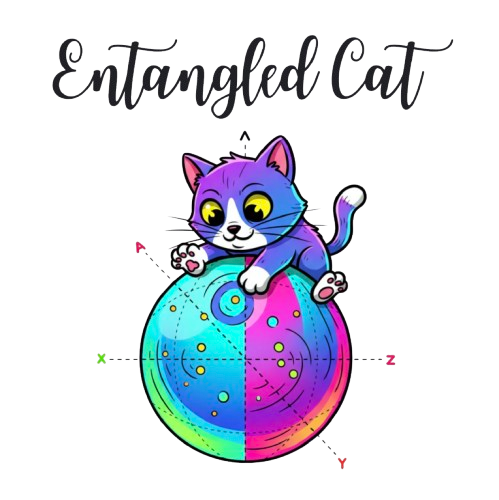
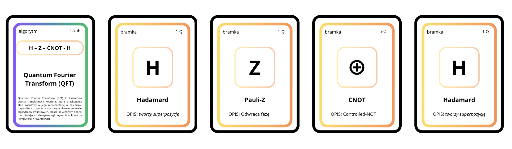
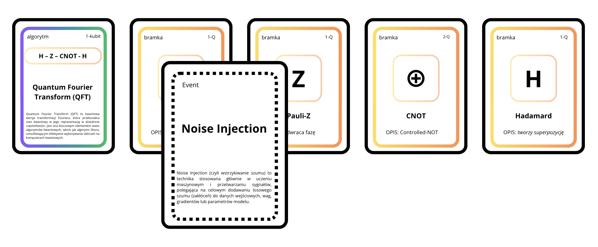

# Entangled Cat



> An open-source quantum-computing-inspired tabletop card game. 

Build quantum algorithms. Protect them from decoherence. Collapse the wave function before your opponents do.

**Print-and-play. Free forever.**

---

## Table of Contents

1. [About](#about)
2. [Story](#story)
3. [How to Play](#how-to-play)
4. [Quick Start](#quick-start)
5. [Project Structure](#project-structure)
6. [License](#license)

---

## About

Entangled Cat is a hybrid rules-and-data project for a card game that teaches quantum concepts through card-based strategies and algorithm design. Players assemble quantum circuits, manage stability, and execute algorithms before opponents collapse the system.

---

## Story

The most important creature in the universe? A cat, of course—Schrödinger's cat. Just like Arthur Dent tried to find the answer to "life, the universe, and everything" among Vogons, the cat finds it… at home, napping. By watching this mysterious feline, we might just invent quantum algorithms and finally understand the universe—or at least why cats knock things off tables.

---

## How to Play

### Game Objective

Players aim to assemble complete sequences of quantum gates matching those on quantum algorithm cards to earn points. They can disrupt opponents using special cards.

### Setup

The game uses **one single main deck**. At setup, shuffle all Gate, Algorithm, and Special cards together into a single combined deck.

* Place the combined deck face down in the center of the table as the draw pile.
* Each player takes a cardboard **Laboratory Screen** and places it with the artwork facing outward.
* As players draw cards, they keep them secretly behind their screen and organize them into the appropriate sections:
  - **GATES**: gate cards and active circuit pieces
  - **ALGORITHM**: the current algorithm and assembled gate sequence
  - **DECOHERENCE**: disruption, defense, and reaction cards
* Starting Hand: Each player draws exactly **5 random cards** from the combined deck.

### Gameplay - Turn Flow

Special Deck (C): Cards for attacks, defense, and special effects (e.g., Decoherence – remove 1 gate from an opponent’s sequence). All decks are shuffled and combined into a single deck. Each player draws 5 cards at the start.

## Statrt

**Draw Phase:** 5 cards (first turn), 1 card (later turns)

**Action Phase:**
- If you have algorithm + all gates, declare "measurement"
- Arrange cards in the correct order
- Wrong order = lose turn

## Game

Player Interactions: At this point, other players may use special cards to disrupt the execution of the algorithm (e.g., removing or swapping a gate, forcing a measurement). The player performing the measurement can use a defense card, which they place on the opponent’s card. Cards are resolved from the bottom of the stack to the top, with the topmost card being decisive.

Measurement Result:

If the algorithm fails to execute, all algorithm, gate, and event cards are discarded from the game.



If the algorithm executes successfully, the algorithm and gate cards remain with the player who performed the measurement, while the event cards return to the deck. The deck is then reshuffled.



## Cards

Special Cards:
Effects: Repeat a measurement or copy gates from other players.

Scoring:
Simple algorithm (2–3 gates): 10 points.
Medium algorithm (4–5 gates): 20 points.
Complex algorithm (6+ gates or includes QFT): 30–40 points.
Disrupting an opponent’s algorithm: +5 points.
Failed measurement (incomplete sequence): –5 points.

End of Game: The game ends when the gate deck is exhausted or after a set number of turns. The player with the most points wins.


# Entangled Cat

An open-source quantum-computing-inspired tabletop card game.

Build quantum algorithms. Protect them from decoherence. Collapse the wave function before your opponents do.

Print-and-play. Free forever.

---

## Quick Start

- 📖 **Rules:** [`docs/rules/full_rules.md`](docs/rules/full_rules.md)
- 🎴 **Cards:** [`game/cards/`](game/cards/)
- 🔬 **Algorithms:** [`docs/algorithms/`](docs/algorithms/)
- 🖨️ **Print:** [`assets/printable/`](assets/printable/)

## Project Structure

```
.
├── docs/
│   ├── algorithms/       # Algorithm descriptions
│   ├── rules/            # Game rules & FAQ
│   └── mathematics/      # Balancing & probability
├── game/cards/           # Card definitions (YAML)
│   ├── gates/
│   ├── algorithms/
│   └── effects/
├── assets/               # Printables & templates
├── simulator/            # Balance analysis tools
├── community/            # Community content
└── README.md
```

## License

- **Code:** MIT or Apache-2.0
- **Rules & graphics:** CC BY-SA 4.0
